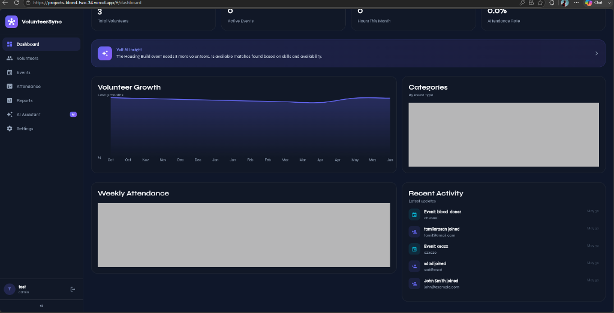

# VolunteerSync Web Deployment

This repository contains only the compiled web build files and the configuration required for Vercel deployment of VolunteerSync.

## 🚀 Project Overview
VolunteerSync is a platform designed to connect and coordinate volunteers with community events, featuring modern UI dashboards, attendance check-ins, reports, and AI helper chats.

## 🛠️ Tech Stack
- **Frontend Build**: Flutter Web (CanvasKit renderer)
- **Deployment Platform**: Vercel
- **Database / Backend**: Supabase

## 📦 Deployment Configuration
The build is configured via [vercel.json](./vercel.json):
- Output Directory: `build/web`
- Rewrite Rules: Routes all paths to `/index.html` for Flutter routing compatibility.

## 🖼️ Screenshots

